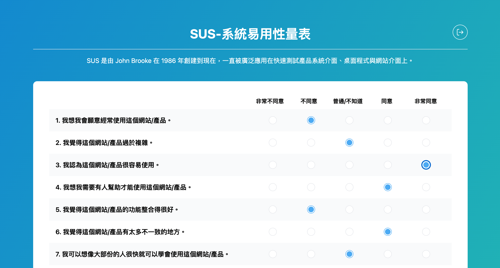
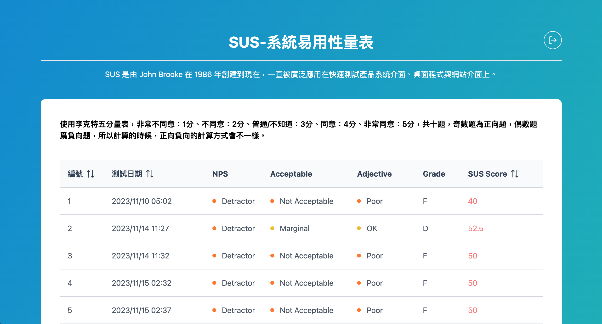
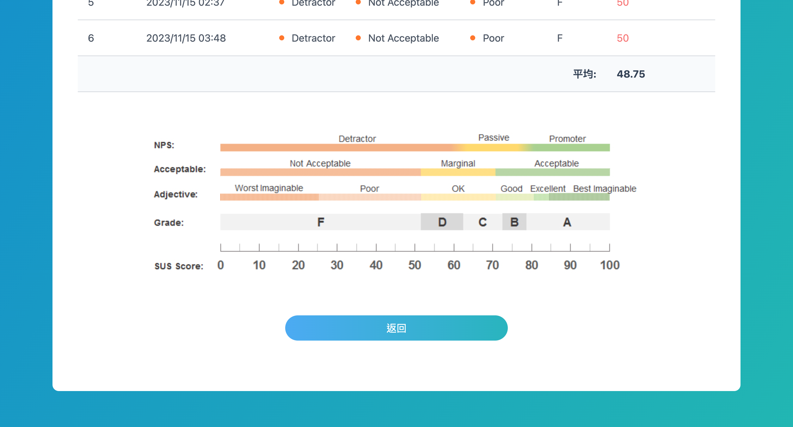
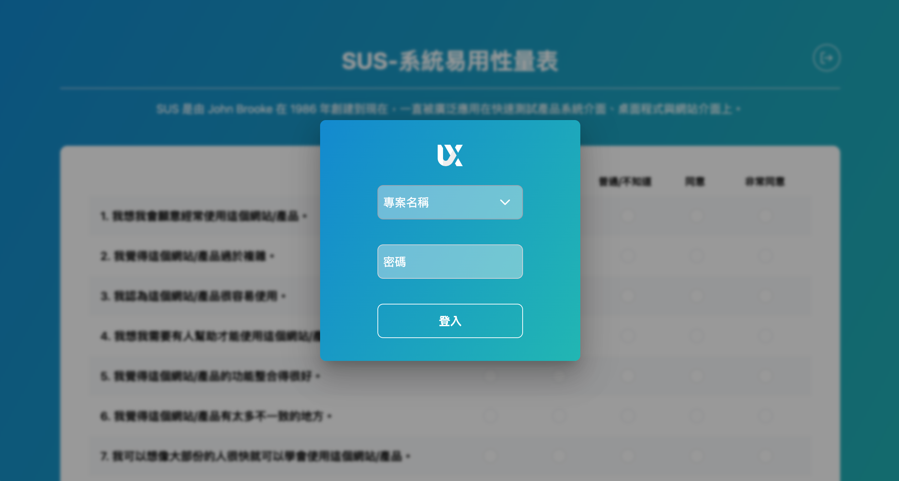

<div align="center">
  

### System Usability Scale Web Application

</div>

### Table of contents

<details>
<summary>Click me</summary>

- [Overview](#-overview)
- [Live demo: https://ux-sus-web.web.app/index
](#-live-demo-https://ux-sus-web.web.app/index)
- [Built with](#-built-with)
- [Key features](#-key-features)
- [Run locally](#-run-locally)
- [Development process](#-development-process)
  - [File structure](#-file-structure)
  - [Api features](#-api-features)

</details>

## Overview
The SUS web application is a full-stack web application that allows UX designers to efficiently measure the usability of projects and services, such as hardware, software, mobile devices, websites, and applications, through the System Usability Scale (SUS).

## Live demo: https://ux-sus-web.web.app/index
* [UI](https://xd.adobe.com/view/fd6d89da-caaa-4bb6-99f9-fb2be37e509a-a83e/screen/64013c61-f377-4cbb-a040-6cc392c437ae/)

* Deployed on [Vue](https://vuejs.org/guide/introduction.html) (front-end) and [Firebase](https://firebase.google.com/) (server + DB)


UI@蔡永霖 2023 | F2E@Dastine 2023

## Built with

#### Front-end

- [Vue](https://vuejs.org/guide/introduction.html) - Frontend framework for creating reusable components
- [Tailwind CSS](https://tailwindcss.com/) - Utility-first CSS framework
- [PrimeVue](https://primevue.org/) - UI library for Vue
- [Pinia](https://pinia.vuejs.org/) - Store library for Vue

#### Back-end

- [Firebase](https://firebase.google.com/) - Open-source relational database management system

## Key features

**Answer survey** based on SUS questions.


**View test records** with table UI.



### Other features

**Authentication** (Tester / Admin)


### Future features

- Sign up new user
- Delete test records througn UI button
- And more...

## Run locally

1. Clone this project to your local environment

```bash
$ git clone "https://github.com/dastine0308/system-usability-scale.git"
```

2. Install required packages

```bash
$ npm install
```

3. Start development server. By default, server will be listening on `http://localhost:5173`

```bash
$ npm run dev
```

4. Accounts for testing：

```bash
# Tester
project：(select project)
password：0000

# Admin
project：(select project)
password：VL905
```

5. Type the following command to stop the development server

```bash
ctrl + c
```

#### Deployment (Firebase)

1. Create a Firebase Project on the [Firebase Console](https://console.firebase.google.com/u/0/)

2. Fill in your config variables in `.env.development` and `.env.production` file with the firebase config:
```
VITE_API_KEY = "<apiKey>",
VITE_AUTH_DOMAIN = "<authDomain>",
VITE_PROJECT_ID = "<projectId>",
VITE_STORAGE_BUCKET = "<storageBucket>",
VITE_MESSAGING_SENDER_ID = "<messagingSenderId>",
VITE_APP_ID = "<appId>"
```
    
3. Install the Firebase tools: `npm install -g firebase-tools` and log in `firebase login`

4. Deploy it with `firebase deploy`

## Development process

#### File structure

<details>
<summary>Details</summary>

```
|-- firebase
|   |__ config.js
|-- public                    # 不進行打包編譯的檔案，資料夾（不會壓縮、不會加 hash 值）e.g., icon
|-- src
|   |-- assets                # 靜態資源相關 e.g., 圖片
|   |-- components
|   |   |-- LoginForm.vue     # 登入表單元件
|   |   |-- Result.vue        # 測試結果元件
|   |   |__ SurveyForm.vue    # 測試問卷元件
|   |-- plugins               # 共用插件
|   |   |-- api
|   |   |   |__ index.js
|   |   |__ user
|   |       |__ index.js     
|   |__ router
|   |   |__ index.js
|   |__ stores                # pinia 全域狀態
|   |   |-- pinia.js 
|   |   |__ useUser.js
|   |__ views
|   |   |__ HomeView.vue      # 主頁面
|   |-- App.vue               # 專案的根元件
|   |-- layout.css
|   |-- main.js               # 專案的程式進入點
|   |__ style.css
|-- .env.development          # 環境變數，development 環境
|-- .env.prodection           # 環境變數，production 環境
|-- .eslintrc.cjs
|-- .firebaserc
|-- .gitignore
|-- .prettierrc.json        
|-- firebase.json             # firebase 設定檔
|-- index.html                # 專業模版， Vue 應用程式會透過這個 HTML 頁面來進行
|-- package.json              # 定義相依的相關套件及應用程式的資訊
|-- postcss.config.js         # postcss 設定檔
|-- tailwind.config.js        # tailwind css 設定檔
|__ vite.config.js            # vite 設定檔
```

</details>

#### API features
```
Methods           Urls                      Actions
POST              api/results               add new Result
GET               api/results               get all results
GET               api/projects              get all projects
```
